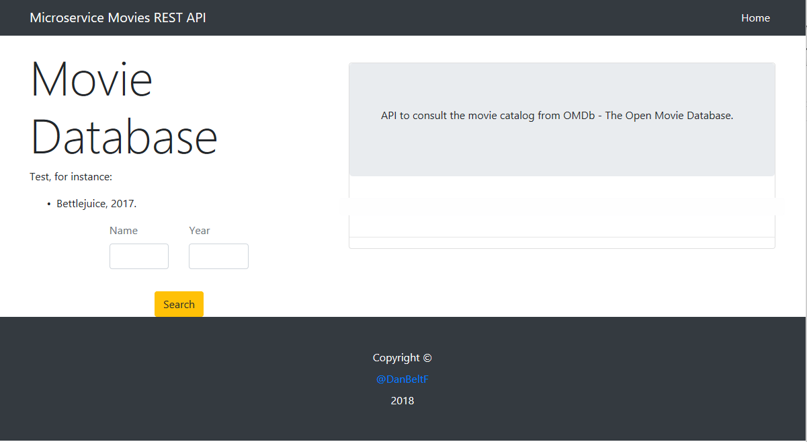
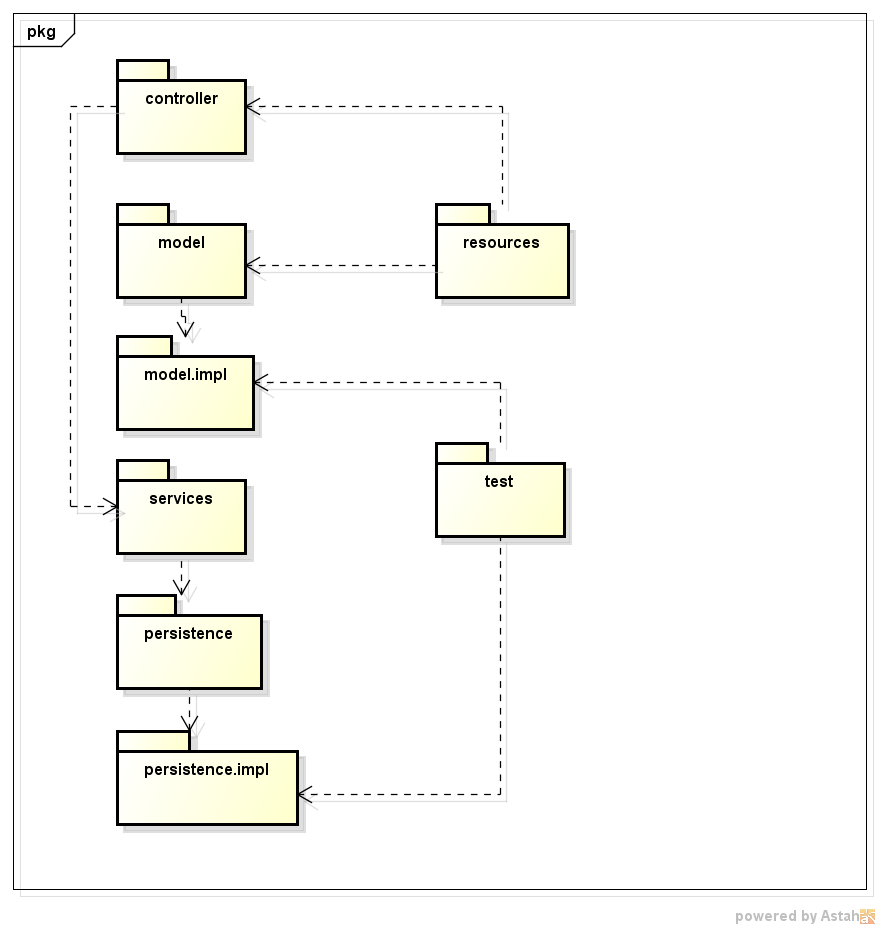
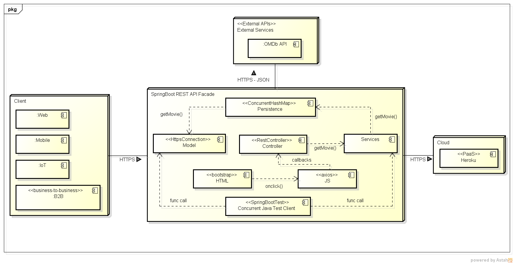

# microservice-movies

---
## Descripción de la arquitectura implementada

La arquitectura MVC (model-view-controller) consiste en un cliente (naturalmente web) quien se conecta a un REST API que usa el framework de SpringBoot el cual provee una vista (que usa bootstrap) que al ingresarle datos en los campos de entrada y al oprimir el botón proporcionado, toma el valor de dichos campos de entrada y, se comunique con una funcion del controlador (el cual es un JavaScript que maneja mensajes tipo JSON implementado sobre axios); este a su vez llama al otro controlador (escrito en Java) para que maneje la solicitud(es) GET. Así pues, se llama a los servicios quienes consultan a la persistencia para mantener en un contenedor temporal las películas que se vayan obteniendo. Más tarde, este último llama a el modelo quien es el que hace la consulta como tal (y el llamado al API externo de OMDb API - The Open Movie Database por medio de una HttpConnection; y de ese modo se obtenga y se muestre la pelicula por pantalla. Finalmente todo se despliega en el PaaS Heroku.
 
---
## Extensión
Para extender el la implementación basta con crear una HttpConnection que implemente el API externo (ya que la estructura en la URL cambia según el API) y así se puedan tener distintas fuentes de consulta de películas.

## Atributos de calidad
- Usabilidad: se tiene usabilidad al ser una página web agradable con fácil uso.
- Mantenibilidad: se hace posiblee extender el código mediante clases, métodos o cualquier otra función extra que se requiera, además se mantiene persistencia de los datos.

---
## Limitaciones de la arquitectura
- No hace uso de autenticación (por TOKEN).

---
#### ARSW-2018-2
#### Daniel Beltrán